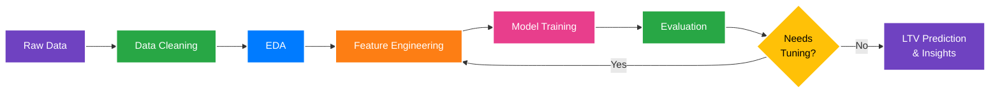

# ValueTrack — Customer Lifetime Value Predictor


## Overview

ValueTrack is a Machine Learning based project that predicts the **Lifetime Value (LTV)** of a customer for a retail/fashion brand. By analyzing customer behavior, purchase history, demographics, and shopping patterns, the model estimates how much value a customer will bring to the business over time.

This helps businesses identify their most valuable customers, optimize marketing spend, and improve customer retention strategies.


---

## Repository Structure

```
valuetrack/
├── data/
│   ├── raw/                # Original unprocessed dataset
│   └── processed/          # Cleaned and feature engineered data
├── experiments/
│   ├── logs/               # Training logs and experiment tracking
│   └── plots/              # EDA and model performance visualizations
├── models/                 # Saved trained models
├── notebooks/              # Jupyter notebooks for EDA and modeling
├── research/               # Reference papers and research material
├── src/                    # Source code and helper scripts
├── app.py                  # Streamlit dashboard
├── main.py                 # Main pipeline entry point
├── requirements.txt        # Project dependencies
├── .gitignore
└── README.md
```

---

## Dataset Features

| Column | Description |
|---|---|
| Customer ID | Unique identifier for each customer |
| Age | Age of the customer |
| Gender | Male / Female |
| Item Purchased | Name of the product purchased |
| Category | Product category |
| Purchase Amount (USD) | Amount spent per transaction |
| Location | Customer location |
| Size | Product size |
| Color | Product color |
| Season | Season of purchase |
| Review Rating | Customer rating after purchase |
| Subscription Status | Whether customer is subscribed or not |
| Shipping Type | Shipping method chosen |
| Discount Applied | Whether discount was used |
| Promo Code Used | Whether promo code was applied |
| Previous Purchases | Number of previous purchases |
| Payment Method | Mode of payment |
| Frequency of Purchases | How often the customer purchases |

---

## Project Workflow



1. **Data Cleaning** — Handle missing values, fix data types
2. **EDA** — Explore patterns, purchase behavior, seasonal trends
3. **Feature Engineering** — Build RFM (Recency, Frequency, Monetary) features
4. **LTV Calculation** — Define and compute LTV target variable
5. **Model Building** — Train ML models (Linear Regression, XGBoost, Random Forest)
6. **Evaluation** — RMSE, MAE, R2 Score
7. **Insights** — Top customer segments, high value customer profiles

---

## Tech Stack

- **Language** — Python 3.8+
- **Data Processing** — Pandas, NumPy
- **Visualization** — Matplotlib, Seaborn
- **Machine Learning** — Scikit-Learn, XGBoost
- **Dashboard** — Streamlit
- **Environment** — Jupyter Notebook

---

## Key Business Questions Answered

1. **Who are our most valuable customers?** Can we identify the specific traits (e.g., location, age, gender) of customers who generate the highest lifetime value?
2. **How does engagement impact spending?** Does having a subscription, using promo codes, or selecting express shipping significantly increase a customer's total value?
3. **Which product categories drive loyalty?** Are there specific product categories (e.g., Outerwear vs. Accessories) that lead to longer retention and higher overall spend?
4. **What is the projected value of a new customer?** Can we accurately predict a new user's lifetime spend based on their initial profile and first few purchases?


---

## Results

> Will be updated once model training is complete.

---

## Team

> Add your team member names here.

---

## License

MIT License
